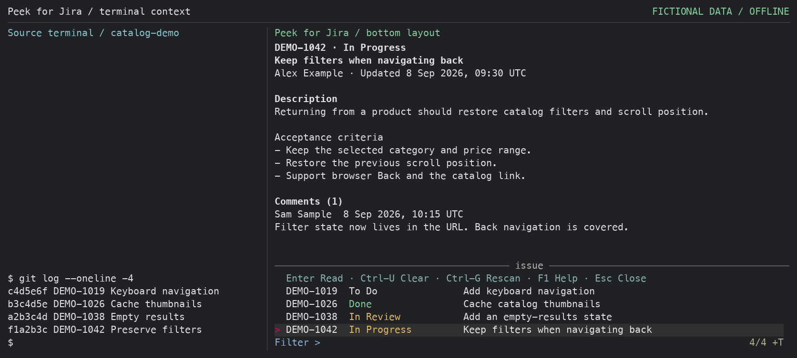
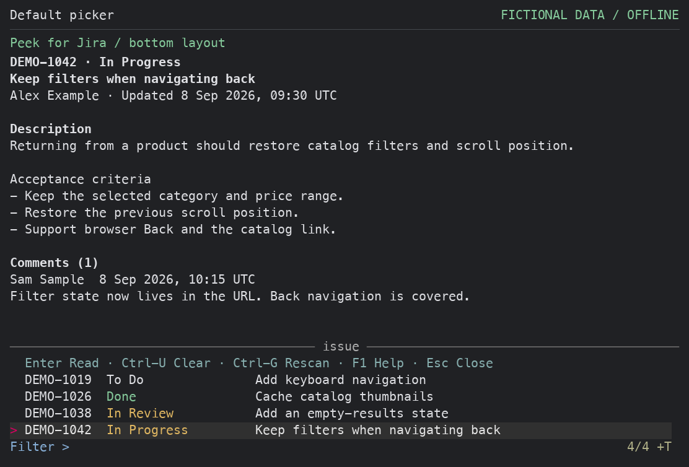
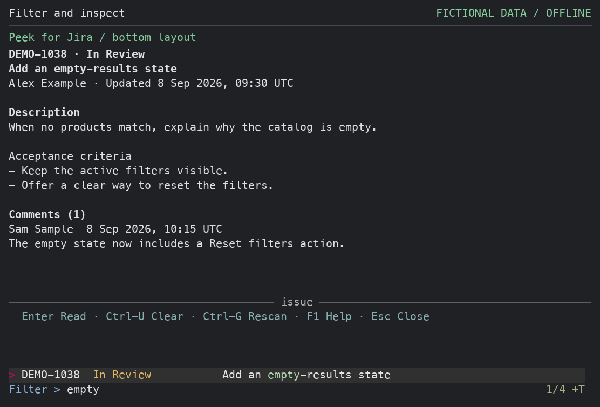

# Peek for Jira

Read-only Jira Cloud previews from your current Herdr pane.

See an issue key in a build log, commit message, or agent output? Invoke
**Peek for Jira** to scan that pane, filter the detected issues, and read the
selected issue's description and comments in an adjacent split.



*The newest issue and filter sit near the source terminal's current output to
reduce eye travel. This offline composition pairs a fictional source log with
captured output from the actual plugin UI; no work session or connected Jira
site is captured.*

[Quick tour](#quick-tour) ·
[Install](#install-and-set-up) · [Configure](#configure) ·
[Controls](#controls-picker-mode) · [Troubleshooting](#troubleshooting)

## Quick tour

1. **Find issues in context.** Run the `peek` action while your source pane
   contains allowed issue keys. The most recent visible occurrences have priority;
   the newest issue is selected at the bottom by default, with older issues above.
   Set `PICKER_LAYOUT='top'` to use the original reading direction.
2. **Choose and preview.** Use the arrow keys or type part of a key, status,
   or summary. The preview follows your selection.
3. **Read more, then return.** Press Enter for the full issue reader and `q`
   to return to the picker. Esc closes the picker. Invoke `peek` again while
   that source's viewer is open to toggle only that viewer closed.

| While you work | Peek helps you |
| --- | --- |
| Review a commit log or agent output | Read the referenced issue without leaving the terminal |
| Follow several issue keys in one pane | Filter a deduplicated list by key, status, or summary |
| Need more context | Read descriptions, acceptance criteria, and comments |
| See new output in the source pane | Press Ctrl-G to rescan in the same viewer |
| Need to act on an issue | Press Ctrl-O to open Jira in your browser |

<details>
<summary>See the default bottom-aligned picker up close</summary>



</details>

<details>
<summary>See the optional top-aligned picker up close</summary>


</details>

### Filter and inspect

Typing `empty` narrows the fictional catalog issues to the matching summary
and updates the preview. The selected issue and filter remain near the bottom:



### Read the full issue

Enter opens the reader with the issue link, description, and comments.
Press `q` to return to your selection:


<details>
<summary>See the wide-terminal layout</summary>

In the optional `top` layout, at 160 columns or more with enough height, the
picker places the issue list beside the preview. Narrower splits stack them
vertically. The default `bottom` layout keeps the preview above the list at
every width.


</details>

## About

Peek for Jira is an unofficial, community Herdr plugin. It is not made by,
endorsed by, or affiliated with Atlassian, Jira, or Herdr. Jira and Atlassian
are trademarks of Atlassian, and all Jira product and service rights belong to
Atlassian.

The plugin scans the focused pane for issue keys, opens a list-first searchable picker in
an adjacent split, and renders a compact issue preview while you work in Herdr.
If you need a richer, full-screen Jira TUI, see the existing
[a2u/herdr-jira](https://github.com/a2u/herdr-jira)
alternative.

## Scope and privacy

- This plugin targets Jira Cloud. The default `twg` backend uses the official
  Atlassian Teamwork Graph CLI and its OAuth connection; the optional `rest`
  backend calls Jira Cloud REST directly.
- Peek for Jira never creates, edits, transitions, comments on, or deletes Jira
  data. Opening a browser and copying a link are local user actions.
- Scanning temporarily writes the source pane's output to private local files
  before extracting allowed issue keys. This can include unrelated terminal
  content. The plugin sends only the extracted keys to the selected backend,
  not the pane text.
- Credentials remain outside this plugin config. TWG authentication is managed
  by TWG; REST uses the configured private netrc file. Requests temporarily
  store raw responses and stderr locally.
- Full issue JSON can contain descriptions and comments. It is fetched lazily
  only for issues you preview. With the default positive TTL it is cached in
  Herdr's private plugin state; expired entries are deleted at runtime startup.
  Set `CACHE_TTL_MIN=0` to disable durable issue caching, or use `clear-cache`
  to remove the cached issue files.
- Each source terminal's last selected key, initial candidate list, and state
  filenames containing issue keys can remain after the viewer closes. Neither `clear-cache` nor
  `CACHE_TTL_MIN=0` removes all plugin state.
- Normal exits and handled signals clean temporary request and scan data.
  Recovery after a forced termination is partial: some abandoned files can
  remain, including raw pane captures. Protect the state directory and see
  [the security policy](SECURITY.md#temporary-data-and-interrupted-processes)
  for cleanup limits.
- The plugin source is MIT-licensed. The end-to-end experience depends on
  separately distributed tools and services with their own terms, availability,
  and privacy policies. See [third-party notices](THIRD_PARTY_NOTICES.md).

## TWG usage and pricing (as of September 19, 2026)

Peek uses the official Atlassian TWG CLI's Jira work-item lookup route. Its
metadata request is equivalent to:

```sh
twg --mode user --api-version v2 --site YOUR_SITE --output json \
  jira workitem get ISSUE-123 --fields summary,status,assignee,updated
```

When you preview an issue without a fresh cached copy, the plugin uses the same
route with `--comments`:

```sh
twg --mode user --api-version v2 --site YOUR_SITE --output json \
  jira workitem get ISSUE-123 --comments
```

At the date above, Atlassian's [TWG usage limits and billing
policy](https://support.atlassian.com/rovo/docs/rovo-usage-limits/) describes
ordinary single-product issue lookups as free, while enriched Teamwork Graph
usage consumes credits. Extra-usage billing for Rovo credits starts December 3,
2026. Atlassian's [beta command
catalog](https://developer.atlassian.com/platform/teamwork-graph/twg-cli/commands/beta-commands-catalog/)
labels `twg jira workitem get` (single or multiple work items) **Free**; Peek
does not invoke enriched or cross-product lookup commands. This documents the
current published policy and does not promise that Atlassian's pricing or
catalog will remain unchanged. Ordinary API rate limits and service
availability still apply separately.

The optional REST backend keeps the plugin independent of future TWG or Rovo
catalog and billing changes. It is a transport choice; direct REST still has
Atlassian rate limits and permission requirements.

## Actions

- `peek` scans visible output first, then recent-unwrapped output, putting the newest actual occurrence first within each source. All detected keys remain searchable and are globally de-duplicated; detection output is used only when neither source contains a key.
  A quiet “Opening Jira Peek…” notification appears before the source scan.
- `open-browser` opens the last issue selected for the focused source or Peek
  viewer in the system browser. A source with no selection reports that nothing
  has been peeked yet.
- `setup` opens a backend-aware setup wizard. It stages a candidate config,
  validates the selected connection, and atomically activates it only on
  success; cancel or failure preserves the working config.
- `install-dependencies` opens a terminal where you choose which backend to
  prepare, then approve each missing package installation. This does not change
  the active connection. It can install fzf, jq, less, and curl with an
  available Homebrew, APT, DNF, or Pacman, and TWG with Atlassian's installer.
  It skips TWG login and agent-skill installation; complete OAuth or REST netrc setup yourself.
- `doctor` performs read-only checks for config, dependencies, private state,
  selected backend and configured Jira Cloud site. It never invokes login/setup.
- `clear-cache` removes only regular files directly inside this plugin's issue
  cache and preserves other state. It also advances the connection epoch,
  invalidating old viewers and pending requests.

The viewer is a responsive right-side split targeted at the action's source pane. It uses a compact filter prompt, a single result counter, and an essential footer that shortens at narrow widths. The quick guide prioritizes Ctrl-U Clear for replacing filters and shows Ctrl-G Rescan when space permits; Ctrl-O remains in F1 Help. F1 expands the header controls without losing the query or selection. `PICKER_LAYOUT` chooses the original top-aligned list or a bottom-aligned list with the preview above it. Resizing recalculates the preview and restores it when space returns. With a
tracked viewer live for the current source, invoking `peek` toggles only that
viewer closed instead of opening a duplicate. Each source terminal can have its
own Peek, including sources in the same workspace or different workspaces.
Switching agents leaves their viewers open with the current filter, selection,
and reader intact. Invoking `peek` inside a viewer closes that viewer. Pane
moves retain the association through the stable terminal ID. The picker shows
key, status, summary, and the formatted issue preview; descriptions and comments are rendered as readable text.

## Requirements

- [Herdr](https://herdr.dev/docs/install/) >= 0.8.2
- The official Atlassian [TWG CLI](https://developer.atlassian.com/cloud/twg-cli/getting-started/installation/)
  >= 1.2.6, authenticated with its Atlassian OAuth flow (only for `twg`)
- `curl` and a private mode-600 netrc file with Jira API credentials (only for `rest`)
- `git` for installation; `jq`, `less`, a POSIX shell, and standard macOS/Linux utilities
- SHA-256 hashing through `sha256sum` or `shasum` (normally included with the OS)
- [`fzf`](https://github.com/junegunn/fzf#installation) is required for the picker
- Progressive updates additionally use a recent fzf exposing
  `--listen-unsafe`, `--id-nth`, and `--track`, plus `curl`; older fzf or no
  curl uses the batch fallback
- On macOS: `open` and `pbcopy`; on Linux: `xdg-open` and one of `wl-copy`,
  `xclip`, or `xsel`

Install `fzf` with `brew install fzf` on macOS or `sudo apt install fzf` on
Debian/Ubuntu; see its installation guide above for other platforms. The plugin
uses the executable directly; fzf shell integration is not required. It must
be on the `PATH` used by Herdr. `fzf` is always required, along with the selected
backend's transport. REST never invokes TWG or silently falls back to it.

## Install and set up

**Latest release:** [0.3.0](https://github.com/hilmimuktitama/herdr-jira-peek/releases/tag/v0.3.0).
The command below installs the full reviewed commit SHA for this release.

With Herdr and git installed, install the plugin:

```sh
herdr plugin install hilmimuktitama/herdr-jira-peek --ref fe7be99d133a3497a46d9ae5d0ca61969e58581f
```

1. Select **Set up Peek for Jira** from Herdr's plugin actions. The wizard
   offers TWG or REST, preserves the current config until validation succeeds,
   and checks `fzf`, `jq`, `less`, and the selected backend's tools. Missing
   requirements or an invalid connection leave the working config unchanged.
2. If tools are missing, select **Install Peek for Jira dependencies**. Review
   each proposed installation in its terminal and enter `y` to approve it.
   Declining installs nothing for that tool. No package manager is installed
   automatically; unsupported systems receive manual installation guidance.
   For TWG, its installer is downloaded from Atlassian and run with `--skip-login`
   and `--skip-skills`; it may update your shell's PATH. REST installs `curl`
   if missing and skips TWG entirely.
3. For TWG, complete [OAuth setup](https://developer.atlassian.com/cloud/twg-cli/getting-started/installation/)
   yourself with `twg setup` in a terminal. For REST, follow the
   [REST authentication steps](#rest-authentication) below. Rerun
   **Set up Peek for Jira** to check again.
4. Edit the config using the [configuration guide](#configure), then run
   **Check Peek for Jira** from Herdr's plugin actions.
5. Once the check succeeds, focus a pane containing an allowed issue key and
   invoke **Peek for Jira issue from pane**. Add the [keybinding](#keybinding)
   for quicker access.

TWG remains the backwards-compatible default. REST is an explicit backend
choice; it never silently falls back to TWG. For local checkouts, see
[contributor setup](CONTRIBUTING.md#local-development).
Connection changes are staged and validated before activation; cancelled or
failed setup keeps the last working configuration. Close and reopen viewers
after changing backend, site, or credentials so workers use one connection
consistently. The runtime fingerprints the connection, purges the flat cache
when that context changes, and discards stale viewer responses. See the
[connection lifecycle plan](docs/connection-lifecycle-plan.md).
Maintainers should use the [release checklist](RELEASING.md).

## Update or remove

If your installation uses the old `hlmmkttm.jira-peek` identifier, follow the
[migration steps](#migrate-from-the-old-plugin-id) before updating.

Close all Peek viewers before updating. When upgrading from the `0.1.0`
development version, old viewers have no recorded source owner. If one remains
open, Peek asks you to close it with Esc before opening another; invoking Peek
inside that old viewer also closes it. Old selection state is not migrated to
an arbitrary agent. Dead tracking records are cleared automatically.

For a GitHub-managed installation,
rerun the install command above to replace the managed checkout with the
reviewed release revision. Keep personal settings in the separate config
directory. Herdr refuses to install over a locally linked checkout; update
that checkout directly instead.

To unregister the plugin and remove its GitHub-managed checkout:

```sh
herdr plugin uninstall jira-peek
```

For a locally linked checkout, use `herdr plugin unlink jira-peek`.
These are [Herdr's plugin management commands](https://herdr.dev/docs/cli-reference/#plugins).
For removal of retained plugin data, see [local data cleanup](SECURITY.md#local-data-cleanup).

### Migrate from the old plugin ID

The plugin ID is now `jira-peek`. Older installations used
`hlmmkttm.jira-peek`; this was a fixed author namespace shown on every device,
not a value read from your Jira account or local configuration.

1. Close existing Peek viewers across Herdr sessions. Before uninstalling or
   updating, locate your old config with
   `herdr plugin config-dir hlmmkttm.jira-peek` and save a private copy of its
   `config.sh` if you want to reuse your settings.
2. Remove the old registration: `herdr plugin uninstall hlmmkttm.jira-peek` for
   a GitHub-managed installation, or `herdr plugin unlink hlmmkttm.jira-peek`
   for a locally linked checkout.
3. Install using the pinned command in [Install and set up](#install-and-set-up),
   or update your local checkout and link it again. Run **Set up Peek for Jira**. The new
   config directory is shown by `herdr plugin config-dir jira-peek`; reapply
   your saved settings there. TWG authentication remains managed by TWG.
4. Update your keybinding to `command = "jira-peek.peek"` and any other action
   bindings from `hlmmkttm.jira-peek.*` to `jira-peek.*`. Run
   `herdr server reload-config`, then **Check Peek for Jira**.

Herdr treats the new ID as a separate plugin identity. Selection and cache
state are not migrated. To remove old retained data, follow
[local data cleanup](SECURITY.md#local-data-cleanup) for the old plugin's state
directory; do not confuse it with the new plugin's directory.

## Configure

The setup wizard uses `config.example.sh` as its safe starting point and writes
only after the selected connection validates:

```sh
JIRA_BASE='https://your-site.atlassian.net'
JIRA_BACKEND='twg'
JIRA_SITE='your-site'
JIRA_NETRC_FILE=''
JIRA_CLOUD_ID=''
JIRA_PROJECTS='ABC|DEF'
CACHE_TTL_MIN=10
MAX_CANDIDATES=20
PICKER_LAYOUT='bottom'
```

Set `JIRA_BASE` to a bare HTTPS origin with no context path, trailing slash,
query, fragment, username, or password. `JIRA_BACKEND` is `twg` (the default)
or `rest`. `JIRA_SITE` is required by TWG and ignored by REST. For REST, set
`JIRA_NETRC_FILE` to an absolute path to a mode-600 netrc containing the Jira
API email and token. Optionally set `JIRA_CLOUD_ID` to route through
`api.atlassian.com`; otherwise REST uses `JIRA_BASE`. Keep `JIRA_PROJECTS` an explicit
allowlist such as `ABC|DEF`; do not broaden it to every project unless you
accept the privacy and preview-scope consequences. `KEY_RE` may optionally
override the scan expression, but every detected key must still match
`JIRA_PROJECTS`; it cannot expand the project allowlist. `MAX_CANDIDATES` must
be between 1 and 100; 20 is the default metadata preload size, not a limit on
searchable keys. Older keys show “preview on select” and load their full preview
when selected. Initially, those rows can be filtered by key only; Ctrl-R loads
their status and summary into the picker too.

Choose a reading layout by setting `PICKER_LAYOUT` in the installed `config.sh`:

| Value | Reading behavior |
| --- | --- |
| `bottom` (default) | Newest issue at the bottom, older issues above; filter near the bottom and preview above the list at every width. Up moves toward older issues; Down moves toward newer ones when the filter is empty. |
| `top` | Newest issue at the top, older issues below; preview below the list or beside it in wide panes. |

Bottom alignment is the default to reduce eye travel from the source terminal's
current output. To restore the original top-aligned experience, use:

```sh
PICKER_LAYOUT='top'
```

Find your configuration directory with `herdr plugin config-dir jira-peek`.
Close and reopen Peek after changing the layout. Existing configurations that
omit `PICKER_LAYOUT` use `bottom`; an explicit `top` choice is preserved. Setup
preserves the working configuration when cancelled or unsuccessful. Both layouts keep the same recency priority,
metadata preload order, search matching, and
selection tracking across rescans. If the pane is too short, the preview hides
to leave room for choosing issues and returns when space is available. The
numbered fallback menu keeps its existing text layout.

The config contains backend, URL, site, project, credential-path, candidate,
cache, and layout preferences only. Never put an API token, password, cookie,
or other secret in this file. `config.sh` is parsed as data rather than
executed: use one supported `NAME=value` assignment per line, quoting string
values and putting comments on their own lines.

### REST authentication

Set these preferences in your private plugin `config.sh`:

```sh
JIRA_BACKEND='rest'
JIRA_NETRC_FILE='/absolute/path/to/jira-peek.netrc'
# Set this for a scoped API token; leave empty for an unscoped token.
JIRA_CLOUD_ID='your-cloud-id'
```

Create the netrc file outside the repository with permissions `600` (or `400`).
Use your editor to enter the account email and API token there. This fictional
example shows the format for scoped tokens:

```text
machine api.atlassian.com
login reader@example.test
password REPLACE_WITH_API_TOKEN
```

For an unscoped token, leave `JIRA_CLOUD_ID` empty and use the hostname from
`JIRA_BASE` as the netrc `machine`, without `https://` or a path. The config is
parsed literally: use an absolute path, not `~` or `$HOME`. See Atlassian's
[API token instructions](https://support.atlassian.com/atlassian-account/docs/manage-api-tokens-for-your-atlassian-account/)
for creating scoped tokens and finding your cloud ID. The read endpoints use
`read:jira-work`; the doctor's identity check also requires `read:jira-user`
when using classic scopes. For granular scopes, follow each endpoint's
[REST API reference](https://developer.atlassian.com/cloud/jira/platform/rest/v3/).

Run **Check Peek for Jira** after configuring authentication. The picker,
reader, comments, filtering, refresh, rescan, links, and cache controls work
the same with either backend. Available data still depends on the selected
account's permissions. REST errors never trigger a TWG fallback.

Before changing backend, site, or account credentials, close all Peek viewers.
The runtime detects the connection context, purges the flat cache, advances the
epoch, and rejects stale responses. Then reopen Peek. **Clear Peek for Jira
cache** remains available when credentials are revoked or unavailable.

### Request behavior

The picker first makes one metadata-only request for up to `MAX_CANDIDATES`
recent keys (no descriptions or comments). It retains every detected key in the
list, including keys outside that batch. With TWG:

```sh
 twg --mode user --api-version v2 --site "$JIRA_SITE" --output json \
  jira workitem get KEY... --fields summary,status,assignee,updated
```

When `JIRA_BACKEND='twg'`, preview uses the full direct-JSON request:

```sh
 twg --mode user --api-version v2 --site "$JIRA_SITE" --output json \
  jira workitem get KEY --comments
```

When `JIRA_BACKEND='rest'`, the equivalent metadata and detail requests use
Jira Cloud REST with `curl --netrc-file "$JIRA_NETRC_FILE"`. A cloud ID routes
through `https://api.atlassian.com/ex/jira/ID`; otherwise the configured
`JIRA_BASE` host is used. REST never invokes TWG or silently falls back to it.
Metadata uses the read-only bulk-fetch endpoint; previews fetch issue fields
and follow comment pagination before caching the result.

TWG output is normalized only when it is one JSON document. Full detail accepts
only a bare object, a `data` object, or a single-item `data` array whose key
matches the request. Picker metadata additionally accepts successful
`data.items[].data` batch entries whose key matches the request; failed,
missing, or wrong-key entries are not accepted. Metadata stays in the private
viewer directory and is removed on normal viewer exit. With `CACHE_TTL_MIN=0`,
full issue data uses a temporary render file instead of a durable cache entry.
See [the security policy](SECURITY.md) for retained keys and interrupted-process
cleanup limits.

## Keybinding

Add the picker action to `~/.config/herdr/config.toml`. We recommend `prefix+i`;
choose another unused key if you already have that binding. Installation does
not add the binding automatically:

```toml
[[keys.command]]
key = "prefix+i"
type = "plugin_action"
command = "jira-peek.peek"
```

With Herdr's default prefix, press `Ctrl+B`, release it, then press `i`.
This binding avoids relying on terminal handling of Alt combinations.

Reload the running Herdr server after changing the config:

```sh
herdr server reload-config
```

The other action IDs are
`jira-peek.open-browser`, `jira-peek.setup`,
`jira-peek.install-dependencies`,
`jira-peek.doctor`, and
`jira-peek.clear-cache`.

## Controls: picker mode

| Key | Action |
| --- | --- |
| Up / Down | Choose an issue and update its preview |
| Type | Filter by key, status, or summary |
| Ctrl-U | Clear the entire filter; type to enter a replacement |
| Ctrl-W | Delete the previous word in the filter |
| Ctrl-A / Ctrl-E | Move to the beginning / end of the filter |
| Enter | Read the selected issue full-screen; press `q` to return |
| PgUp / PgDn | Scroll the preview up / down |
| Ctrl-D | Scroll the preview down half a page |
| Ctrl-O | Open the issue in the browser |
| Ctrl-Y | Copy the issue key |
| Ctrl-L | Copy the issue link |
| Ctrl-G | Rescan the original source terminal |
| Ctrl-R | Remove the cached issue and refetch it |
| Esc | Close the picker and its adjacent pane |

Ctrl-U clears the whole filter even when the cursor is in the middle. On an
empty filter it does nothing and keeps the picker open.

Issue navigation stops at the first and last matching result, including when
the list is filtered. It does not wrap around; preview scrolling is separate.
On opening, Peek synchronizes the viewer's terminal size so Herdr 0.9.0 shows
the bottom filter immediately. This leaves the split divider in place.

Press **F1** to expand or collapse shortcut help above the filter; the shortcut
bar remains under the list. The picker keeps the query and selection while help
is shown, resized, or rescanned. It stacks the navigator and preview in
narrow terminals (up to eight navigator rows, or ten at 45 or more terminal
rows), and uses a right preview only when the terminal is wide and tall enough.
The footer is used when supported by
modern fzf; older fzf versions retain the compact header/basic fallback.
Browser and clipboard confirmations clear after about 3 seconds, and failures
stay for about 6 seconds, when the live picker connection is available. Changing
the filter or selected issue dismisses either message immediately; this is also
how feedback clears on older pickers without the live connection.

The normal picker is stacked in narrow splits and side-by-side only in wide
ones. `Ctrl-R` refreshes the selected issue's metadata/detail; it does not
rescan the source pane. `Ctrl-G` rescans the original source terminal in the
same viewer, preserving filter and selection when possible. It performs no
Herdr pane layout operations. On fzf 0.63 or newer, “Rescanning source pane…”
appears immediately and the picker stays usable while the scan runs; repeated
Ctrl-G presses are ignored until it finishes. The message then changes to the
result or an error. With the live picker connection, rescans run in a dedicated
worker, so resizing the pane or waiting for Jira cannot cancel a source scan.
Unchanged results update only the status, preserving the preview and its scroll
position. Older fzf versions show a quiet Herdr notification during the scan;
the basic menu prints the progress message before reading the source.

## Controls: reader mode

The full-screen reader uses `q` to return to the picker (or basic menu),
arrows to scroll, and `Space`/`b` for the next/previous page. `PgUp`/`PgDn`
remain supported; on a MacBook, use `Fn`+Up/Down. Its muted help reads `q back
· ↑↓ scroll · Space/b page`; the reader also labels the full view **Issue
details**. Short issues start at the top of the pane, with unused space below.

## Controls: basic mode

If an installed fzf fails to start, a numbered recovery menu keeps detected
issues reachable. Upgrade fzf if this happens. Enter
reads the selected issue; enter a number or exact key to select and read it.
Use `n`/`p` for next/previous, `r` to refresh only the selected issue, `s` to
rescan the original terminal, and `q` to close. Every command must be followed
by Enter. Reader `q` returns to the menu. Failed or keyless rescans preserve
the previous list. All detected candidates remain searchable; alternate-screen and
terminal scrollback limits can prevent recovery of older output.

## Troubleshooting

- **Doctor says config is missing:** select **Set up Peek for Jira**, then edit
  the copied template. Setup preserves an existing file and rechecks dependencies.
- **Doctor says the selected backend is unavailable or unauthenticated:** for
  TWG, install the official CLI and run `twg setup`; for REST, install `curl`
  and verify the absolute mode-600 `JIRA_NETRC_FILE`. Rerun doctor; it never
  runs login/setup or prints auth output.
- **TWG is authenticated but site access or requests fail:** confirm `JIRA_SITE`
  and your Jira access. Your organization may restrict TWG OAuth permissions
  or request IP locations. Follow [Atlassian's permission guidance](https://developer.atlassian.com/cloud/twg-cli/getting-started/configure-permissions/)
  with your administrator; permission changes may require re-authentication.
- **No issue key is found:** check that the focused pane contains a Jira key and
  that its project is in `JIRA_PROJECTS`. If you set `KEY_RE`, it must also
  match the key.
- **A terminal Jira link opens normally:** this is intentional. Peek for Jira
  does not register a generic link handler; use the pane-scanning `peek` action.
- **Doctor or peek says fzf is required:** install `fzf` using the
  [requirements](#requirements) instructions and ensure Herdr can find it on
  `PATH`, then rerun doctor. No split opens while fzf is missing.
- **The adjacent pane shows a numbered recovery menu:** an installed `fzf`
  failed to start. Review the displayed diagnostic and upgrade fzf.
- **The shortcut does nothing:** confirm the binding uses `jira-peek.peek`,
  reload Herdr's config, and try `prefix+i` if an Alt combination is not
  reaching Herdr. Run doctor to check dependencies and configuration.
- **Browser or copy controls fail:** install the platform utility listed under
  Requirements and confirm it is on `PATH`.

## License and contribution

The plugin code is available under the [MIT License](LICENSE). Contributions
are welcome under the same MIT terms; by submitting a patch, you grant the
project permission to distribute that contribution under MIT. See
[CONTRIBUTING.md](CONTRIBUTING.md) and [SECURITY.md](SECURITY.md).
