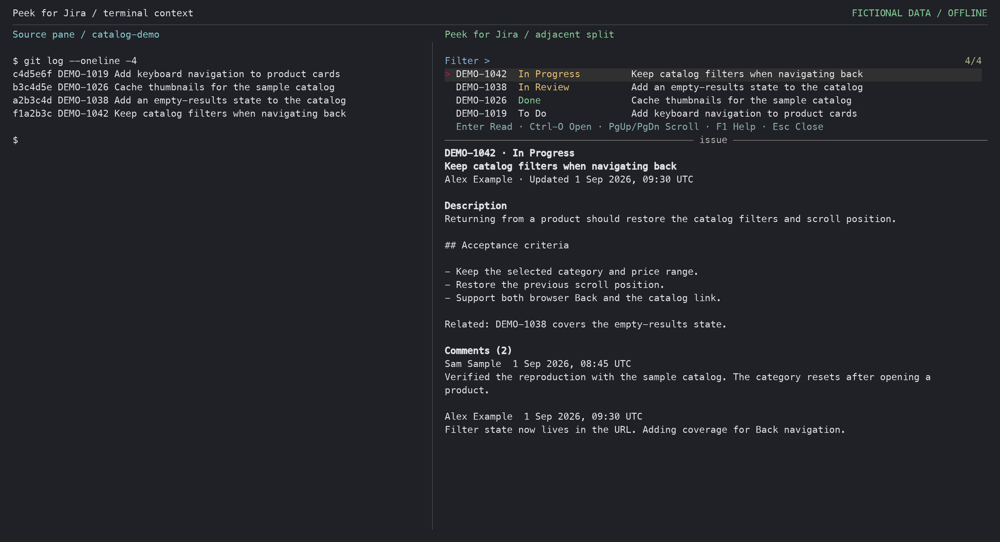
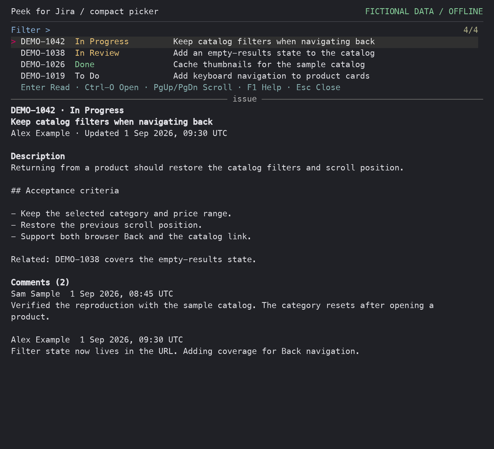
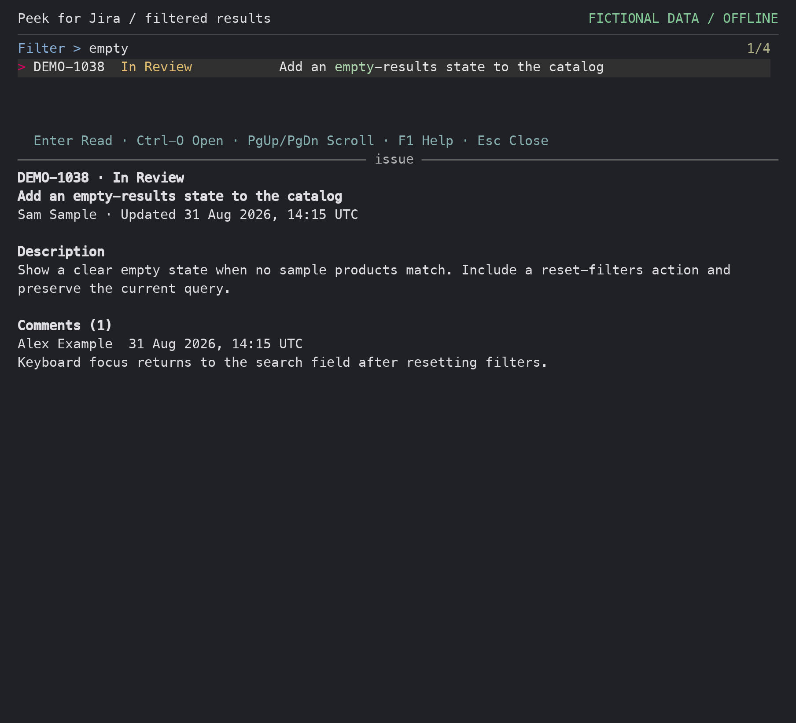
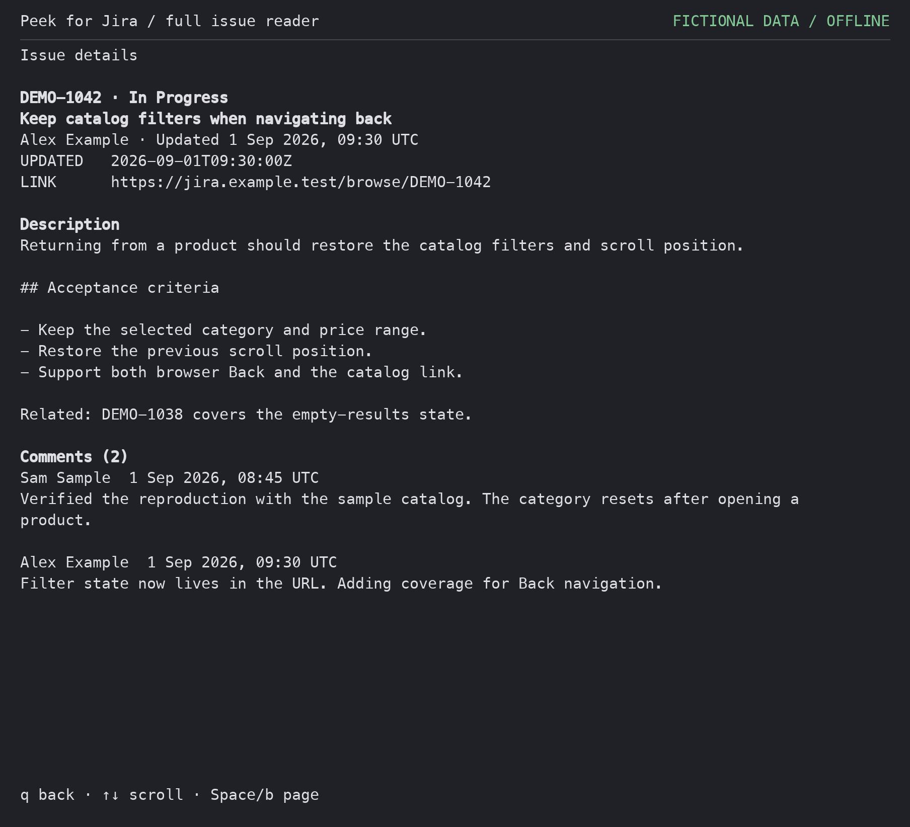
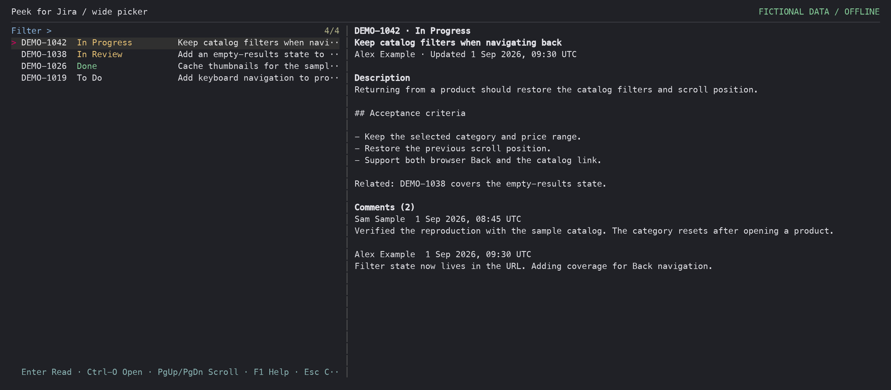

# Peek for Jira

Read-only Jira Cloud previews from your current Herdr pane.

See an issue key in a build log, commit message, or agent output? Invoke
**Peek for Jira** to scan that pane, filter the detected issues, and read the
selected issue's description and comments in an adjacent split.



*Your source pane stays visible on the left while Peek opens beside it on the
right. This offline composition pairs the fictional source log with the actual
plugin UI; no work session or connected Jira site is captured.*

[Quick tour](#quick-tour) ·
[Install](#install-and-set-up) · [Configure](#configure) ·
[Controls](#controls-picker-mode) · [Troubleshooting](#troubleshooting)

## Quick tour

1. **Find issues in context.** Run the `peek` action while your source pane
   contains allowed issue keys. The most recent visible occurrences come first.
2. **Choose and preview.** Use the arrow keys or type part of a key, status,
   or summary. The preview follows your selection.
3. **Read more, then return.** Press Enter for the full issue reader and `q`
   to return to the picker. Esc closes the picker. Invoke `peek` again while
   its tracked viewer is open to toggle it closed.

| While you work | Peek helps you |
| --- | --- |
| Review a commit log or agent output | Read the referenced issue without leaving the terminal |
| Follow several issue keys in one pane | Filter a deduplicated list by key, status, or summary |
| Need more context | Read descriptions, acceptance criteria, and comments |
| See new output in the source pane | Press Ctrl-G to rescan in the same viewer |
| Need to act on an issue | Press Ctrl-O to open Jira in your browser |

<details>
<summary>See the compact picker up close</summary>



</details>

### Filter and inspect

Typing `empty` narrows the fictional catalog issues to the matching summary
and updates the preview:



### Read the full issue

Enter opens the reader with the issue link, description, and comments.
Press `q` to return to your selection:



<details>
<summary>See the wide-terminal layout</summary>

At 160 columns or more with enough height, the picker places the issue list
beside the preview. Narrower splits stack them vertically.



</details>

## About

Peek for Jira is an unofficial, community Herdr plugin. It is not made by,
endorsed by, or affiliated with Atlassian, Jira, or Herdr. Jira and Atlassian
are trademarks of Atlassian, and all Jira product and service rights belong to
Atlassian.

The plugin scans the focused pane for issue keys, opens a list-first searchable picker in
an adjacent split, and renders a compact issue preview. Its narrow wedge is a
fast, read-only preview while you work in Herdr. If you need a richer,
full-screen Jira TUI, see the existing [a2u/herdr-jira](https://github.com/a2u/herdr-jira)
alternative.

## Scope and privacy

- This plugin targets Jira Cloud and only requests issue data through the
  official Atlassian Teamwork Graph CLI (TWG) and its OAuth connection.
- Peek for Jira never creates, edits, transitions, comments on, or deletes Jira
  data. Opening a browser and copying a link are local user actions.
- TWG authentication remains outside this plugin; do not add credentials to
  `config.sh`. Raw TWG responses and stderr may exist transiently in private
  request state while a request is running; they are not intended as durable
  plugin data or displayed diagnostic text.
- Full issue JSON can contain descriptions and comments. It is fetched lazily
  only for issues you preview. With the default positive TTL it is cached in
  Herdr's private plugin state; expired entries are deleted on each invocation.
  Set `CACHE_TTL_MIN=0` to disable durable issue caching. Protect the state
  directory and use `clear-cache` to remove only the issue cache.
- The plugin source is MIT-licensed. The end-to-end experience depends on
  Herdr and the proprietary TWG service/tool, which have their own terms,
  availability, and privacy policies.

## Actions

- `peek` scans visible output first, then recent-unwrapped output, putting the newest actual occurrence first within each source. Candidates are globally de-duplicated and capped; detection output is used only when neither source contains a key.
- `open-browser` opens the last issue shown in the system browser.
- `setup` copies the public config template without overwriting an existing
  file. It copies from Herdr's `HERDR_PLUGIN_ROOT`, never from the caller's
  current directory.
- `doctor` performs read-only checks for config, dependencies, private state,
  TWG version/authentication, and the configured Jira Cloud site. It never
  invokes `twg login` or `twg setup`.
- `clear-cache` removes only regular files directly inside this plugin's issue
  cache and preserves other state.

The viewer is a responsive right-side split targeted at the action's source pane. It uses a compact filter prompt, a single result counter, and an essential footer that shortens at narrow widths. F1 expands the header controls without losing the query or selection; in stacked layouts the shortcut bar sits below the list and above the preview divider. Resizing recalculates the preview and restores it when space returns. With a
tracked viewer live, invoking `peek` toggles it closed instead of opening a
duplicate. The picker shows key, status, summary, and the formatted issue
preview; descriptions and comments are rendered as readable text.

## Requirements

- Herdr plugin support with Herdr >= 0.8.2
- The official Atlassian [TWG CLI](https://developer.atlassian.com/cloud/twg-cli/)
  >= 1.2.6, authenticated with its Atlassian OAuth flow
- `jq`, `less`, and standard POSIX utilities
- `fzf` is optional; without it a numbered list keeps every detected issue reachable. Enter reads the selected issue and `q` returns to the list (and exits from the list).
- Progressive updates additionally use a recent fzf exposing
  `--listen-unsafe`, `--id-nth`, and `--track`, plus `curl`; older fzf or no
  curl uses the batch fallback
- On macOS: `open` and `pbcopy`; on Linux: `xdg-open` and one of `wl-copy`,
  `xclip`, or `xsel`

## Install and set up

If this repository is public and available to your Herdr installation, install
it through Herdr:

```sh
herdr plugin install hlmmkttm/herdr-jira-peek
```

Then select **Set up Peek for Jira** from Herdr's plugin actions. The action
refuses to overwrite an existing config and prints the exact next steps. Edit
the installed config for your own Jira account and site, authenticate the
official TWG CLI through its Atlassian OAuth flow, and run **Check Peek for
Jira**. TWG is a prerequisite: this plugin has no direct API-token fallback,
and its setup action is not a credential or login wrapper.

For a first real use, wait for **Check Peek for Jira** to succeed. Then put a
permitted real issue key from your configured project allowlist in the focused
source pane and invoke **Peek for Jira issue from pane** (the `peek` action).
The action scans that pane and opens the read-only preview.

For a checkout during development:

```sh
herdr plugin link "$PWD"
```

Run the setup action from Herdr after linking; `HERDR_PLUGIN_ROOT` is supplied
by Herdr, so setup remains independent of the current working directory.

This repository currently describes `0.1.0` as unreleased. No immutable
release tag is claimed here. At release, use the reviewed immutable reference
published in that release, for example:

```sh
herdr plugin install <owner>/<repository> --ref <reviewed-commit>
```

The placeholder is not an installable release reference.

Maintainers preparing the first release should use the concise
[release checklist](RELEASING.md). This project has no publish automation.

## Configure

The setup action copies `config.example.sh` into the plugin config directory.
Its safe starting point is deliberately narrow:

```sh
JIRA_BASE='https://your-site.atlassian.net'
JIRA_SITE='your-site'
JIRA_PROJECTS='ABC|DEF'
CACHE_TTL_MIN=10
MAX_CANDIDATES=20
```

Set `JIRA_BASE` to a bare HTTPS origin with no context path, trailing slash,
query, fragment, username, or password. `JIRA_SITE` is the Atlassian site
prefix (or bare cloud ID) used by TWG. Keep `JIRA_PROJECTS` an explicit
allowlist such as `ABC|DEF`; do not broaden it to every project unless you
accept the privacy and preview-scope consequences. `KEY_RE` may optionally
override the derived issue-key expression. `MAX_CANDIDATES` must be between 1
and 100; 20 is the recommended default.

The config contains URL, site, project, candidate, and cache preferences only.
TWG owns OAuth and credential storage. Never put an API token, password,
cookie, or other secret in this file. `config.sh` is parsed as data rather than
executed: use one supported quoted `NAME=value` assignment per line, with
comments on their own lines.

The picker first makes one capped, metadata-only request (no descriptions or
comments):

```sh
 twg --mode user --api-version v2 --site "$JIRA_SITE" --output json \
  jira workitem get KEY... --fields summary,status,assignee,updated
```

When you preview an issue, the plugin makes the full direct-JSON request:

```sh
 twg --mode user --api-version v2 --site "$JIRA_SITE" --output json \
  jira workitem get KEY --comments
```

TWG output is normalized only when it is one JSON document. Full detail accepts
only a bare object, a `data` object, or a single-item `data` array whose key
matches the request. Picker metadata additionally accepts successful
`data.items[].data` batch entries whose key matches the request; failed,
missing, or wrong-key entries are not accepted. Metadata stays in the private
viewer directory and is removed when the viewer
closes; a later invocation also reaps PID-stamped viewer/fetch state whose
creating process no longer exists. With `CACHE_TTL_MIN=0`, full issue data is
held in a private temporary file only for the current render and removed
afterward; no issue JSON is left in the durable cache.

## Keybinding

Add the picker action to `~/.config/herdr/config.toml`. `prefix+alt+j` is an
example chosen to avoid the common `prefix+j` binding:

```toml
[[keys.command]]
key = "prefix+alt+j"
type = "plugin_action"
command = "hlmmkttm.jira-peek.peek"
```

Reload the running Herdr server after changing the config:

```sh
herdr server reload-config
```

The other action IDs are
`hlmmkttm.jira-peek.open-browser`, `hlmmkttm.jira-peek.setup`,
`hlmmkttm.jira-peek.doctor`, and
`hlmmkttm.jira-peek.clear-cache`.

## Controls: picker mode

| Key | Action |
| --- | --- |
| Up / Down | Choose an issue and update its preview |
| Type | Filter by key, status, or summary |
| Enter | Read the selected issue full-screen; press `q` to return |
| PgUp / PgDn, Ctrl-D / Ctrl-U | Scroll the preview |
| Ctrl-O | Open the issue in the browser |
| Ctrl-Y | Copy the issue key |
| Ctrl-L | Copy the issue link |
| Ctrl-G | Rescan the original source terminal |
| Ctrl-R | Remove the cached issue and refetch it |
| Esc | Close the picker and its adjacent pane |

Press **F1** to expand or collapse shortcut help above the filter; the shortcut
bar remains under the list. The picker keeps the query and selection while help
is shown, resized, or rescanned. It stacks the navigator and preview in
narrow terminals (up to eight navigator rows), and uses a right preview only
when the terminal is wide and tall enough. The footer is used when supported by
modern fzf; older fzf versions retain the compact header/basic fallback.

The normal picker is stacked in narrow splits and side-by-side only in wide
ones. `Ctrl-R` refreshes the selected issue's metadata/detail; it does not
rescan the source pane. `Ctrl-G` rescans the original source terminal in the
same viewer, preserving filter and selection when possible. It performs no
Herdr pane layout operations.

## Controls: reader mode

The full-screen reader uses `q` to return to the picker (or basic menu),
arrows to scroll, and `Space`/`b` for the next/previous page. `PgUp`/`PgDn`
remain supported; on a MacBook, use `Fn`+Up/Down. Its muted help reads `q back
· ↑↓ scroll · Space/b page`; the reader also labels the full view **Issue
details**.

## Controls: basic mode

Without fzf, the numbered list keeps every detected issue reachable. Enter
reads the selected issue; enter a number or exact key to select and read it.
Use `n`/`p` for next/previous, `r` to refresh only the selected issue, `s` to
rescan the original terminal, and `q` to close. Every command must be followed
by Enter. Reader `q` returns to the menu. Failed or keyless rescans preserve
the previous list. Candidate lists remain capped; alternate-screen and
terminal scrollback limits can prevent recovery of older output.

## Troubleshooting

- **Doctor says config is missing:** select **Set up Peek for Jira**, then edit
  the copied template. Setup refuses to overwrite an existing file.
- **Doctor says TWG is missing, old, or unauthenticated:** install the official
  TWG CLI, then run `twg setup` yourself and rerun the doctor action. Doctor
  never runs setup and never prints auth output.
- **No issue key is found:** check that the focused pane contains a Jira key and
  that `JIRA_PROJECTS` or `KEY_RE` matches its project.
- **A terminal Jira link opens normally:** this is intentional. Peek for Jira
  does not register a generic link handler; use the pane-scanning `peek` action.
- **The adjacent pane opens without a picker:** install `fzf`; basic mode still
  displays the numbered issue list and selected issue reader.
- **Browser or copy controls fail:** install the platform utility listed under
  Requirements and confirm it is on `PATH`.

## License and contribution

The plugin code is available under the [MIT License](LICENSE). Contributions
are welcome under the same MIT terms; by submitting a patch, you grant the
project permission to distribute that contribution under MIT. See
[CONTRIBUTING.md](CONTRIBUTING.md) and [SECURITY.md](SECURITY.md).
